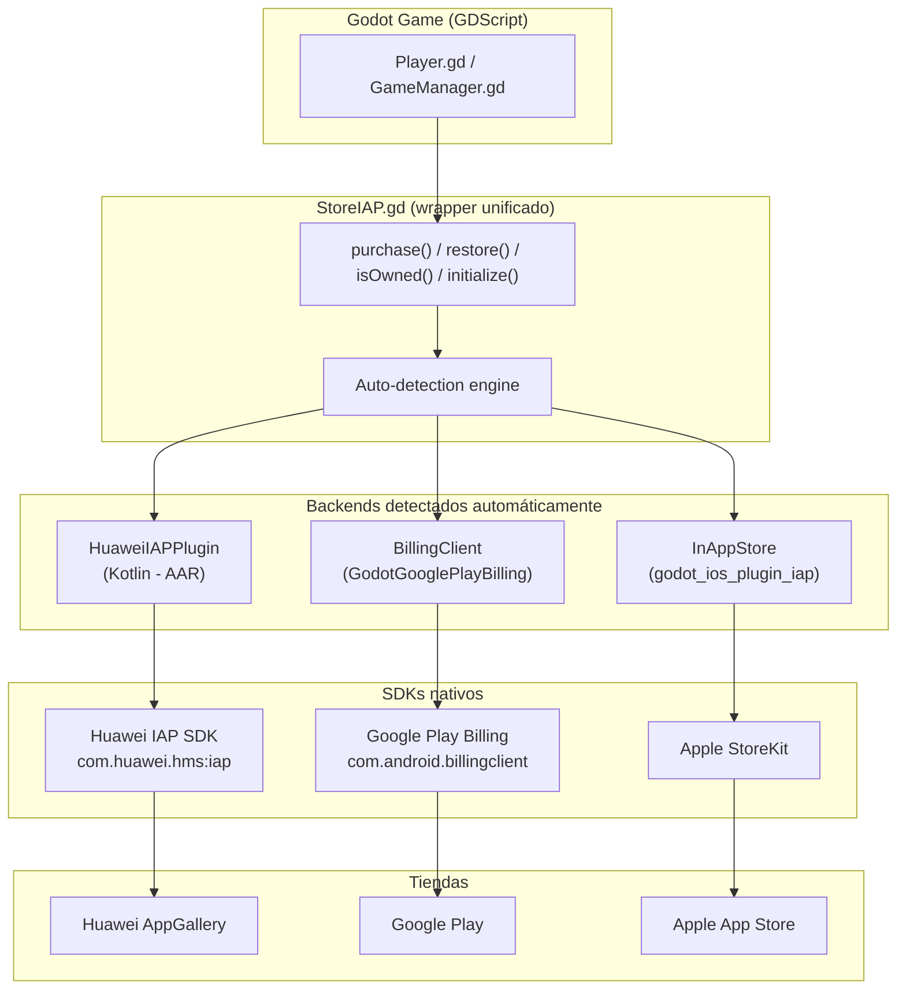
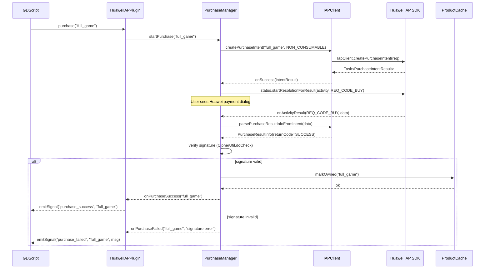
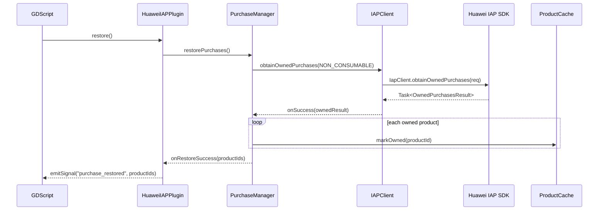
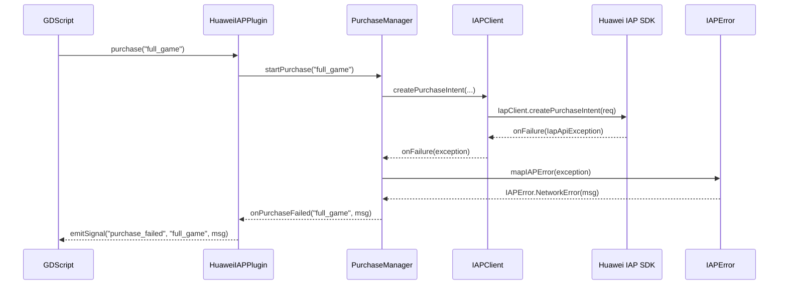

# Design Document — Godot Huawei IAP Plugin

## Overview

Arquitectura en 3 capas:

1. **StoreIAP.gd** — Capa GDScript unificada. El desarrollador solo usa esta clase.
2. **Backends** — HuaweiIAPPlugin (Kotlin), BillingClient (Google), InAppStore (Apple). StoreIAP auto-detecta cuál está disponible.
3. **SDKs nativos** — Huawei IAP Kit, Google Play Billing, Apple StoreKit.

Cada backend se integra como plugin independiente. StoreIAP.gd los unifica con una API común.

## Architecture



## Components and Interfaces

### 1. HuaweiIAPPlugin
- **Responsabilidad**: Puente Godot ↔ Kotlin. Expone métodos con `@UsedByGodot`, registra y emite señales, maneja ciclo de vida (onActivityResult).
- **Inputs**: Llamadas desde GDScript (`purchase`, `restore`, `isOwned`, `initialize`)
- **Outputs**: Señales Godot (`purchase_success`, `purchase_failed`, `purchase_restored`)
- **Dependencias**: `PurchaseManager`, `ProductCache`
- **Métodos**:
  - `initialize()` → delega a `PurchaseManager.initialize()`
  - `purchase(productId: String)` → delega a `PurchaseManager.startPurchase(productId)`
  - `restore()` → delega a `PurchaseManager.restorePurchases()`
  - `isOwned(productId: String): Boolean` → consulta `ProductCache.isOwned(productId)`

### 2. PurchaseManager
- **Responsabilidad**: Orquestar flujo de compra y restauración. Manejar `onActivityResult` para el diálogo de pago de Huawei.
- **Inputs**: Comandos desde `HuaweiIAPPlugin`, resultado de pago desde `onActivityResult`
- **Outputs**: Llamadas a `IAPClient`, actualizaciones a `ProductCache`, emisión de señales vía callback
- **Dependencias**: `IAPClient`, `ProductCache`, `HuaweiIAPCallback`
- **Métodos clave**:
  - `startPurchase(productId: String)` → crea `PurchaseIntentReq`, inicia pago
  - `handleActivityResult(requestCode, resultCode, data)` → parsea resultado, verifica firma, actualiza cache
  - `restorePurchases()` → obtiene compras prevías, actualiza cache
  - `initialize(context: Context)` → prepara el `IapClient`

### 3. IAPClient
- **Responsabilidad**: Encapsular todas las llamadas al SDK `com.huawei.hms.iap.IapClient`. Ninguna otra clase debe importar el SDK de Huawei directamente.
- **Inputs**: Parámetros de negocio (`productId`, `priceType`)
- **Outputs**: `Task<T>` del SDK de Huawei
- **Métodos clave**:
  - `obtainProductInfo(productIds: List<String>, priceType: Int): Task<ProductInfoResult>`
  - `createPurchaseIntent(productId: String, priceType: Int, developerPayload: String): Task<PurchaseIntentResult>`
  - `parsePurchaseResultInfoFromIntent(data: Intent): PurchaseResultInfo`
  - `obtainOwnedPurchases(priceType: Int): Task<OwnedPurchasesResult>`

### 4. ProductCache
- **Responsabilidad**: Mantener en memoria el conjunto de productos poseídos. Fuente única de verdad para `isOwned()`.
- **Inputs**: Product IDs a marcar/consultar
- **Outputs**: Booleanos de ownership
- **API**:
  - `markOwned(productId: String)`
  - `isOwned(productId: String): Boolean`
  - `setOwnedProducts(productIds: Set<String>)`
  - `clear()`

### 5. IAPError
- **Responsabilidad**: Mapear códigos de error de Huawei IAP (`IapApiException.statusCode`) a mensajes legibles y tipo de error.
- **Estructura**:
  ```kotlin
  sealed class IAPError {
      data class UserCancelled(val productId: String) : IAPError()
      data class ProductOwned(val productId: String) : IAPError()
      data class NetworkError(val message: String) : IAPError()
      data class HmsNotAvailable(val message: String) : IAPError()
      data class Unknown(val code: Int, val message: String) : IAPError()
  }
  ```

## Sequence Diagrams

### Purchase Flow (Success)



### Restore Flow



### Error Flow



### 6. StoreIAP.gd (wrapper GDScript)
- **Responsabilidad**: Única API pública para el desarrollador. Auto-detecta el backend disponible y delega.
- **Inputs**: Llamadas desde el juego GDScript
- **Outputs**: Señales Godot unificadas
- **Detección** (en orden):
  1. `Engine.has_singleton("HuaweiIAP")` → Huawei
  2. `Engine.has_singleton("InAppStore")` → Apple
  3. `ClassDB.class_exists("BillingClient")` → Google
- **API expuesta**:
  ```gdscript
  func initialize()
  func purchase(product_id: String)
  func restore()
  func is_owned(product_id: String) -> bool
  signal purchase_success(product_id: String)
  signal purchase_failed(product_id: String, error: String)
  signal purchase_restored(product_ids: PackedStringArray)
  ```

## Mapeo de backends

### Huawei → StoreIAP

| StoreIAP | HuaweiIAP |
|---|---|
| `initialize()` | `Engine.get_singleton("HuaweiIAP").initialize()` |
| `purchase(id)` | `.purchase(id)` |
| `restore()` | `.restore()` |
| `is_owned(id)` | `.isOwned(id)` → `Boolean` |
| `purchase_success` | `.purchase_success` |
| `purchase_failed` | `.purchase_failed` |
| `purchase_restored` | `.purchase_restored` |

### Google Play → StoreIAP

| StoreIAP | GodotGooglePlayBilling |
|---|---|
| `initialize()` | `BillingClient.new()`, `start_connection()` |
| `purchase(id)` | `.purchase({product_id: id})` |
| `restore()` | `.query_purchases(0)` |
| `is_owned(id)` | `.is_purchased(id)` |
| `purchase_success` | `.on_purchase_updated` |
| `purchase_failed` | `.on_purchase_updated` (con código error) |
| `purchase_restored` | `.query_purchases_response` |

### Apple StoreKit → StoreIAP

| StoreIAP | godot_ios_plugin_iap |
|---|---|
| `initialize()` | `Engine.get_singleton("InAppStore")` |
| `purchase(id)` | `.purchase({product_id: id})` |
| `restore()` | `.restore_purchases()` |
| `is_owned(id)` | `.get_pending_event_count()` + check events |
| `purchase_success` | event `type="purchase"` + `result="ok"` |
| `purchase_failed` | event `result="error"` |
| `purchase_restored` | event `type="restore"` + `result="ok"` |

## Dependencies (Gradle) — Solo para Huawei

```kotlin
dependencies {
    implementation("org.godotengine:godot:4.7.0.stable")
    implementation("com.huawei.hms:iap:6.12.0.302")
}

repositories {
    maven { url = uri("https://developer.huawei.com/repo/") }
}
```

## Error Handling

| Huawei Status Code | IAPError | Signal | Mensaje |
|---|---|---|---|
| `ORDER_STATE_SUCCESS` (0) | N/A | `purchase_success` | - |
| `ORDER_STATE_CANCEL` (60051) | `UserCancelled` | `purchase_failed` | "Payment cancelled by user" |
| `ORDER_PRODUCT_OWNED` (60073) | `ProductOwned` | `purchase_success` | "Product already owned" |
| `ORDER_HWID_NOT_LOGIN` (60031) | `HmsNotAvailable` | `purchase_failed` | "HUAWEI ID not signed in" |
| `ORDER_IT_CONNECT_ERROR` (60002) | `NetworkError` | `purchase_failed` | "Connection error" |
| Otros | `Unknown` | `purchase_failed` | Código + mensaje original |

## Testing Strategy

- **Unit tests**: Test `PurchaseManager` con mock de `IAPClient` y `ProductCache`
- **Unit tests**: Test `ProductCache` operaciones de set/get
- **Unit tests**: Test `IAPError` mapeo de códigos
- **Integración manual**: Usar app demo Godot + Huawei device real o cloud debugging
- **Sanbox**: El SDK de Huawei usa sandbox automático cuando el app no está publicada (solo usuarios test de AppGallery Connect)

## Extensibilidad futura

- `PriceType` se pasa como parámetro: `CONSUMABLE(0)`, `NON_CONSUMABLE(1)`, `SUBSCRIPTION(2)`
- Para añadir consumibles: crear `ConsumePurchaseManager` o extender `PurchaseManager` con método `consumePurchase(productId)`
- Para suscripciones: `PurchaseManager` ya acepta `priceType`, solo cambiar el tipo y añadir lógica de renovación
- `ProductCache` puede extenderse con expiración para suscripciones
